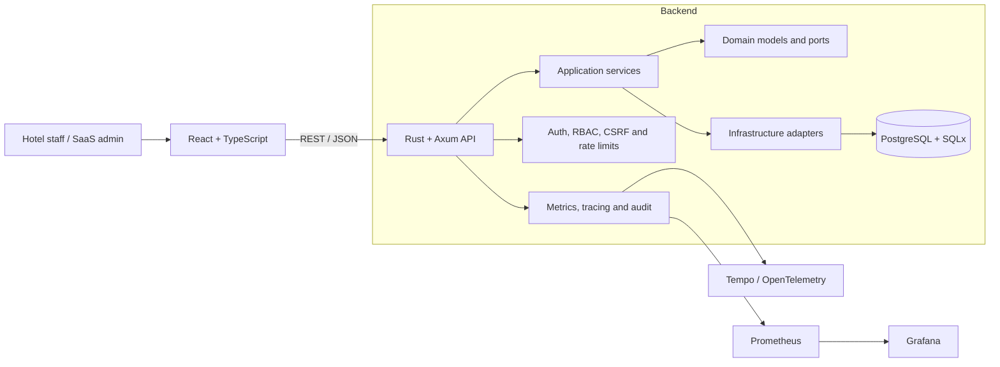

# HMS Elite — Multi-Hotel Management SaaS

[](https://github.com/sjo1848/hotel-management-system/actions/workflows/full-stack-ci.yml)

**Full-stack reference implementation for hotel operations, built with Rust, Axum, React and PostgreSQL.**

HMS Elite centralizes hotel operations, security, financial workflows and operational insights in a multi-tenant SaaS architecture. The repository is designed to demonstrate backend engineering, domain modelling, frontend integration, automated QA, security controls, observability and deployment readiness.

> **Status:** active development. The core product flows and quality gates are implemented; public screenshots, a hosted demo and a tagged stable release remain pending.

## Why this project matters

This is not a basic CRUD demo. HMS Elite models a real operational domain with multiple roles, tenant isolation and business-critical workflows:

- Multi-hotel administration and tenant-scoped data.
- Rooms, bookings, guests and housekeeping.
- Users, capabilities, RBAC and audit events.
- Extra charges, invoices and cash closure.
- Occupancy, revenue and operational KPIs.
- Security regression tests, telemetry and production-readiness scripts.

## What this repository demonstrates

| Area | Evidence |
|---|---|
| Backend engineering | Rust, Axum, Tokio, SQLx, PostgreSQL and REST APIs |
| Architecture | Clean/Hexagonal boundaries across domain, application and infrastructure |
| Full-stack delivery | React + TypeScript frontend integrated with the Rust API |
| Security | AuthN/AuthZ, capability-based RBAC, tenant isolation, CSRF/auth regression checks and rate limiting |
| Quality assurance | Unit, integration, browser E2E, security, performance and core-journey gates |
| Operations | Docker Compose, health/readiness, backup/restore, deploy rollback and environment validation |
| Observability | Prometheus, Grafana, Tempo, OpenTelemetry, request tracing and operational metrics |

## Core workflows

- Authenticate users and resolve their hotel, role and capabilities.
- Create and manage rooms, guests and bookings.
- Enforce hotel-scoped authorization and prevent cross-tenant data access.
- Operate housekeeping queues and room-status transitions.
- Register extra charges, issue invoices and close cash.
- Explore occupancy, revenue and network-level KPIs.
- Audit critical actions and inspect runtime telemetry.

## Architecture



The backend follows Clean/Hexagonal Architecture:

- **Domain:** business models, security contracts and repository ports.
- **Application:** use cases, orchestration and business services.
- **Infrastructure:** PostgreSQL repositories, HTTP handlers, middleware, auth and observability.

The frontend uses a feature-first organization with centralized HTTP handling and deny-by-default route protection based on capabilities.

## Technology stack

### Backend

- Rust, Axum and Tokio.
- SQLx and PostgreSQL 16.
- Utoipa / OpenAPI.
- Capability-based RBAC and tenant-scoped authorization.

### Frontend

- React 18 and TypeScript.
- Vite and Tailwind CSS.
- Feature-first modules and protected routes.

### Quality and operations

- Docker and Docker Compose.
- GitHub Actions.
- Playwright browser E2E.
- Prometheus, Grafana, Tempo and OpenTelemetry.
- Automated security, performance and stability gates.

## Quality strategy

The main workflow, `.github/workflows/full-stack-ci.yml`, validates:

1. Secret scanning.
2. Environment-profile security.
3. OpenAPI and documentation alignment.
4. Formatting, linting and type checks.
5. Backend unit and SQLx integration tests.
6. RBAC, authentication and CSRF security regressions.
7. Frontend tests and production build.
8. Browser E2E for core journeys.
9. Performance smoke baselines.
10. CI stability thresholds.

Relevant local gates:

```bash
./scripts/ci-backend.sh
./scripts/ci-backend-integration.sh
./scripts/backend-security-regression.sh
./scripts/qa-core-journeys.sh
./scripts/perf-baseline.sh --report /tmp/perf_baseline.md
```

## Quick start

### Requirements

- Docker.
- Docker Compose.

### Run the stack

```bash
git clone https://github.com/sjo1848/hotel-management-system.git
cd hotel-management-system
cp .env.example .env
docker compose up --build
```

### Local services

| Service | URL |
|---|---|
| Frontend | `http://localhost:5173` |
| Backend API | `http://localhost:3001` |
| Health check | `http://localhost:3001/health` |
| Readiness check | `http://localhost:3001/ready` |
| Swagger UI | `http://localhost:3001/swagger-ui` |

## Repository structure

```text
.
├── backend/                 # Rust API and domain implementation
│   ├── src/
│   │   ├── domain/
│   │   ├── application/
│   │   └── infrastructure/
│   ├── migrations/
│   └── tests/
├── frontend/                # React + TypeScript client
├── monitoring/              # Prometheus, Grafana, Tempo and OTel
├── scripts/                 # QA, security, deployment and operational tooling
├── database/                # Legacy bootstrap compatibility layer
└── docs/                    # API, architecture and portfolio documentation
```

## API and contracts

Base prefix: `/api/v1`

Main domains:

- `auth`
- `hotels`
- `rooms`
- `bookings`
- `guests`
- `users`
- `housekeeping`
- `billing`
- `invoices`
- `reports`
- `analytics`
- `audit`

The canonical contract is `backend/openapi.yaml`. Alignment with `docs/openapi.yaml` is verified automatically by `scripts/check-openapi-alignment.sh`.

## Production-oriented controls

- Access and refresh-token flows.
- Capability-based authorization and tenant filtering.
- Security headers, CORS policy and request body limits.
- General and authentication-specific rate limiting.
- Request IDs, audit events, metrics and distributed tracing.
- Production environment validation.
- Backup, restore and deploy-with-rollback scripts.
- Health, readiness and performance gates.

## Documentation

- [Portfolio case study](docs/PORTFOLIO_CASE_STUDY.md)
- [Implementation status](docs/PROJECT_STATUS.md)
- [OpenAPI contract](backend/openapi.yaml)
- [Changelog](docs/CHANGELOG.md)

## Current priorities

- Publish verified screenshots and a short product walkthrough.
- Provide a hosted read-only demonstration environment.
- Tag a stable portfolio release.
- Continue validating usability and operational workflows with realistic hotel scenarios.

## Scope note

HMS Elite is a portfolio-grade reference implementation under active development. Production adoption would additionally require organization-specific legal, privacy, billing, support, infrastructure and operational validation.