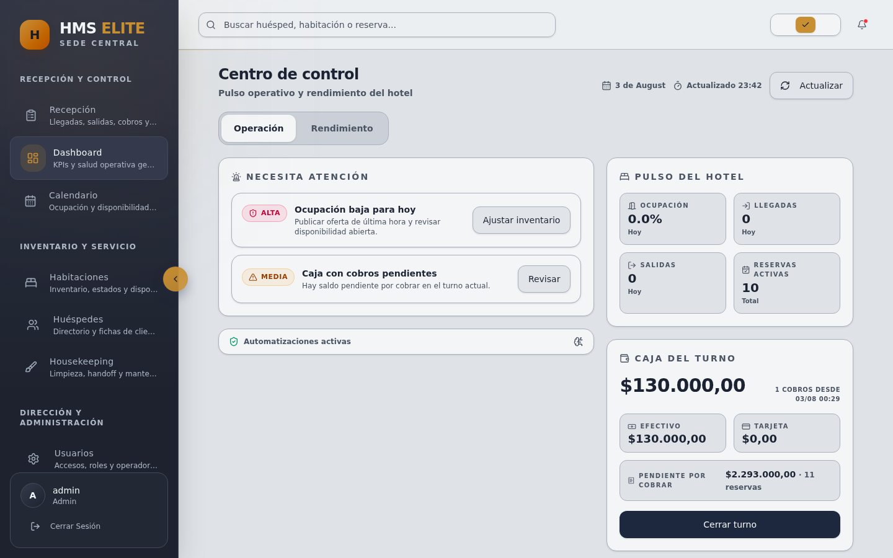
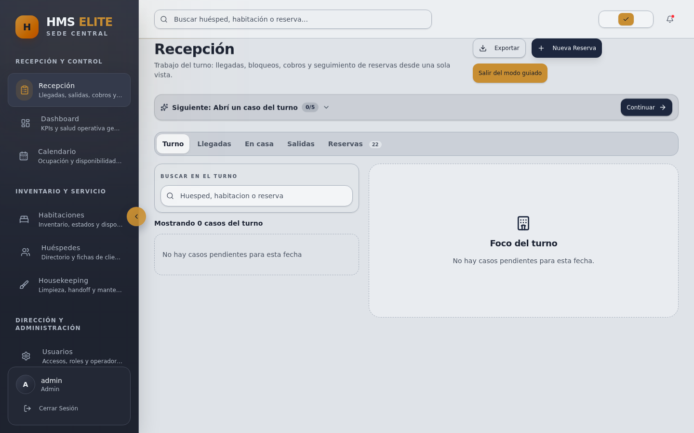
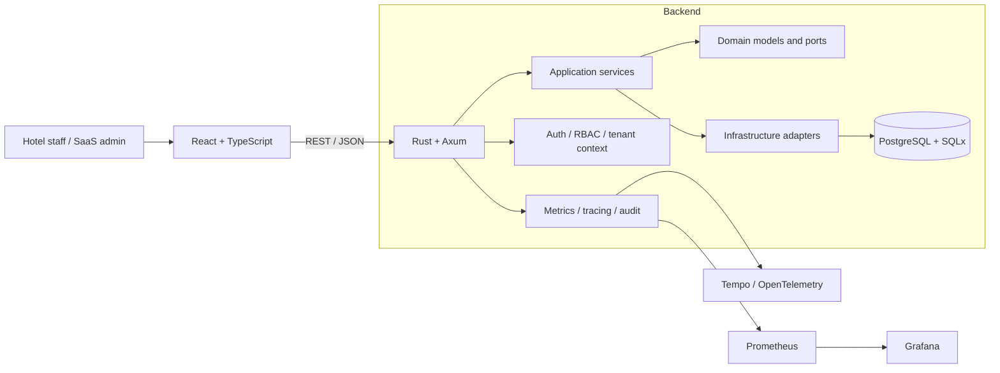

# HMS Elite

**Hotel operations platform for reception, reservations, rooms, housekeeping, billing and multi-hotel administration.**

[](https://github.com/sjo1848/hotel-management-system/actions/workflows/full-stack-ci.yml)

HMS Elite coordinates day-to-day hotel workflows around a shared operational state: who is arriving, which rooms are available, what reception needs to do next, what housekeeping must prepare, and how charges and payments move through a stay.



## What it does

- **Reception:** reservations, walk-ins, arrivals, check-in, stay operations and checkout.
- **Rooms:** availability, status transitions, rates, holds and maintenance states.
- **Guests:** guest records and booking context.
- **Housekeeping:** cleaning queues and room handoff after checkout.
- **Billing:** extra charges, invoices, payments and cash closure.
- **Administration:** users, roles, capabilities and audit events.
- **Multi-hotel:** hotel-scoped data plus network-level administration and reporting.

### Reception workspace



More verified product screens are available in [`docs/screenshots`](docs/screenshots/README.md).

## Core workflow

A representative reception journey is:

```text
reservation / walk-in
        ↓
      guest
        ↓
   room assignment
        ↓
     check-in
        ↓
 charges + payments
        ↓
     checkout
        ↓
room release → housekeeping
```

The workflow is exercised through browser E2E tests on desktop and mobile widths, with the backend and PostgreSQL participating in the same journey.

## Engineering decisions

### Modular monolith

The backend keeps domain, application and infrastructure boundaries inside one deployable service. This preserves transactional consistency while the product domain is still evolving and avoids introducing distributed-system overhead without an operational reason.

### Tenant isolation is enforced below the UI

Hotel identity is propagated through authorization and persistence operations. Tenant boundaries are backed by repository scoping, database constraints and targeted RLS policies rather than relying on frontend filtering.

### Capabilities instead of role checks scattered through the codebase

Users receive roles, but authorization is expressed through explicit capabilities. Route protection and frontend navigation are deny-by-default and the RBAC contract is checked for frontend/backend drift.

### Operational transitions use explicit services

Booking lifecycle changes are not treated as generic CRUD updates. Check-in, checkout, room changes and related side effects use transactional paths so room state, financial state and audit history stay coordinated.

### API and QA are treated as contracts

The API is versioned under `/api/v1` with an OpenAPI contract. CI checks formatting, linting, PostgreSQL integration, authorization/security regressions, browser journeys, performance smoke thresholds and contract drift.

A longer discussion of these choices is available in the [engineering case study](docs/ENGINEERING_CASE_STUDY.md).

## Architecture



```text
backend/src/
├── domain/          # business models, policies and repository contracts
├── application/     # use cases and workflow orchestration
└── infrastructure/  # PostgreSQL, HTTP, auth and observability adapters
```

## Technology

| Area | Main tools |
|---|---|
| Backend | Rust, Axum, Tokio |
| Data | PostgreSQL 16, SQLx |
| Frontend | React, TypeScript, Vite, Tailwind CSS |
| API | REST, OpenAPI / Utoipa |
| Testing | Rust tests, Vitest, Playwright |
| Operations | Docker Compose, GitHub Actions |
| Observability | Prometheus, Grafana, Tempo, OpenTelemetry |

## Quality gates

The main workflow in [`.github/workflows/full-stack-ci.yml`](.github/workflows/full-stack-ci.yml) includes:

- secret scanning and production-profile validation;
- Rust formatting, Clippy and unit tests;
- PostgreSQL / SQLx integration tests;
- authentication, authorization, CSRF and tenant regression checks;
- OpenAPI and RBAC drift checks;
- frontend type checks, tests and production build;
- browser E2E for core hotel journeys;
- reception lifecycle checks at mobile widths;
- performance smoke thresholds;
- CI stability checks.

## Run locally

### Requirements

- Docker
- Docker Compose

```bash
git clone https://github.com/sjo1848/hotel-management-system.git
cd hotel-management-system
cp .env.example .env
docker compose up --build
```

Local services:

| Service | URL |
|---|---|
| Frontend | `http://localhost:5173` |
| Backend API | `http://localhost:3001` |
| Health | `http://localhost:3001/health` |
| Readiness | `http://localhost:3001/ready` |
| Swagger UI | `http://localhost:3001/swagger-ui` |

## Repository layout

```text
.
├── backend/       # Rust API, domain and migrations
├── frontend/      # React + TypeScript application
├── monitoring/    # Prometheus, Grafana, Tempo and OTel
├── scripts/       # QA, security and operational tooling
├── database/      # legacy bootstrap compatibility layer
└── docs/          # architecture, API, operations and product evidence
```

## Documentation

- [Engineering case study](docs/ENGINEERING_CASE_STUDY.md)
- [Implementation status](docs/PROJECT_STATUS.md)
- [OpenAPI contract](backend/openapi.yaml)
- [Changelog](docs/CHANGELOG.md)
- [Product screenshots](docs/screenshots/README.md)
- [ADR index](docs/adr/README.md)
- [Operator runbook](docs/ops/operator-runbook.md)

## Current state

- Core reception lifecycle implemented and validated through automated and human acceptance flows.
- Verified desktop product screenshots are committed in the repository.
- Stable portfolio snapshot `v0.1.0` is tagged.
- A public hosted demo is not linked yet.
- Production adoption still requires environment-specific infrastructure, privacy, operational and support validation.
