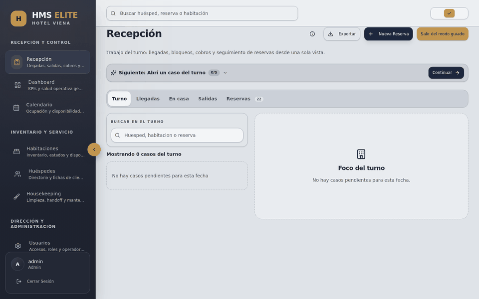
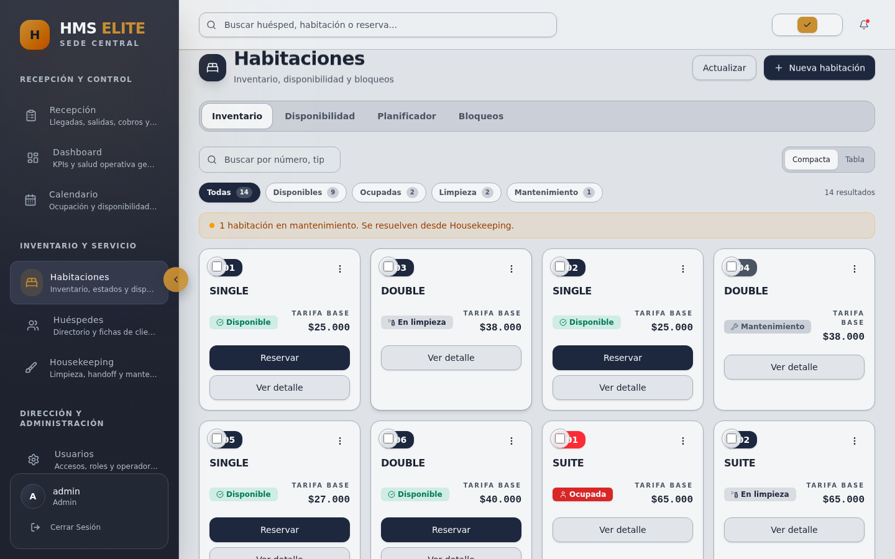
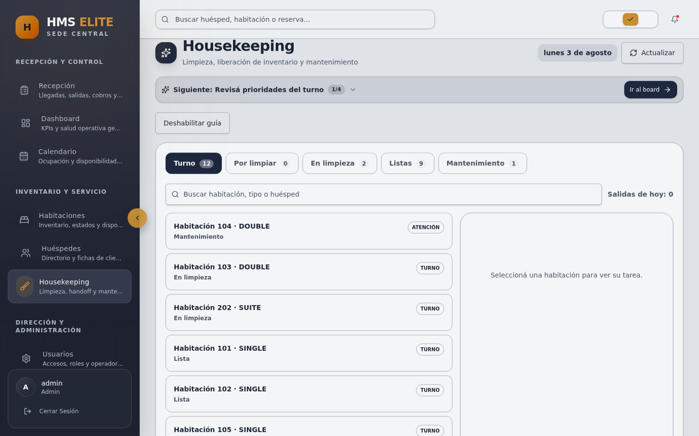
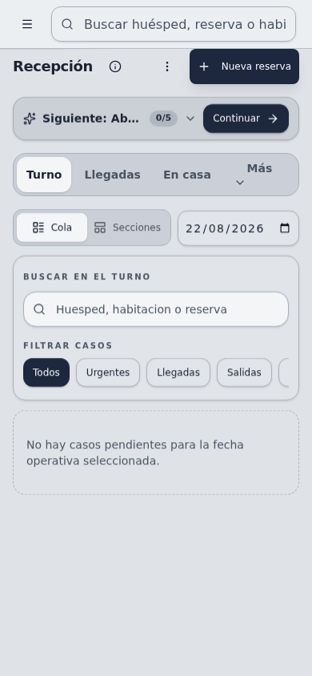

# HMS Elite

**A production-oriented hotel management system built around real reception, room, housekeeping and billing workflows.**

HMS Elite is a multi-hotel property management platform for reservations, arrivals, check-in, room state, charges, payments, checkout and housekeeping handoff.

The product combines a Rust/Axum API, React + TypeScript frontend, PostgreSQL persistence, hotel-scoped authorization, browser-tested operational journeys and production-oriented operational tooling.

## Product walkthrough

Captured from the running application with synthetic data: reception → reservations → guest case → check-in checklist.

~~~text
Reservation / walk-in → guest and room context → check-in verification
→ stay operations → charges and payments → checkout → housekeeping
~~~

## Product surfaces

### Reception

Arrivals, departures, reservations, walk-ins, guest context and operational checklists.

### Operations dashboard

Occupancy, arrivals, departures, active reservations, cash activity and operational alerts.

### Rooms

Inventory, availability, room states, rates, holds and maintenance context.

### Housekeeping

Cleaning queues, room handoff and maintenance-oriented room operations.

See the [full screenshot walkthrough](docs/screenshots/README.md) for Calendar, Guests, Reports, Users/RBAC and the multi-hotel network view.

## Mobile operations

Reception has dedicated mobile navigation, stepwise walk-in entry, guest/room selection surfaces and an explicit review state.

Core reception journeys are exercised at 375, 390 and 430 pixel widths in CI.

## Key capabilities

- **Reception:** reservations, walk-ins, arrivals, check-in and checkout.
- **Rooms:** availability, operational status, holds and maintenance states.
- **Guests:** guest records and booking context.
- **Housekeeping:** cleaning workflow and room release.
- **Billing:** extra charges, invoices, payments and cash closure.
- **Administration:** users, capabilities, RBAC and audit events.
- **Multi-hotel:** hotel-scoped data and network-level administration surfaces.
- **Security:** authentication, authorization, CSRF controls, rate limits and layered tenant isolation.
- **Operations:** health/readiness, migrations, backups, restore procedures, rollback tooling and production container profiles.

## Architecture

~~~mermaid
flowchart LR
    USER[Hotel staff] --> FE[React + TypeScript]
    FE -->|REST / JSON| API[Rust + Axum]
    API --> APP[Application services]
    APP --> DOMAIN[Domain]
    APP --> INFRA[Infrastructure adapters]
    INFRA --> DB[(PostgreSQL + SQLx)]
    API --> SEC[Auth / RBAC / tenant context]
~~~

The backend is a modular monolith with explicit domain, application and infrastructure boundaries:

~~~text
backend/src/
├── domain/          # business models, policies and repository contracts
├── application/     # use cases and workflow orchestration
└── infrastructure/  # PostgreSQL, HTTP, auth and observability adapters
~~~

The frontend is organized by product feature with centralized API handling and capability-aware protected routes.

## Engineering highlights

- **Tenant boundaries:** scoped repositories, tenant context, relational constraints and targeted PostgreSQL RLS on tenant-scoped data.
- **Capability authorization:** explicit capabilities, backend enforcement, frontend route protection and frontend/backend drift checks.
- **Lifecycle operations:** check-in, checkout, room reassignment and housekeeping handoff are business transitions, not generic CRUD updates.
- **API contract:** versioned `/api/v1` REST API with a single [canonical OpenAPI contract](backend/openapi.yaml) validated against the router and generated client expectations.

## Technology stack

| Area | Technology |
|---|---|
| Backend | Rust, Axum, Tokio |
| Database | PostgreSQL 16, SQLx |
| Frontend | React 18, TypeScript, Vite, Tailwind CSS |
| API | REST, OpenAPI / Utoipa |
| Testing | Rust tests, Vitest, Playwright, axe-core |
| Containers | Docker, Docker Compose |
| CI | GitHub Actions |
| Observability | Prometheus, Grafana, Tempo, OpenTelemetry |

## Quality and security gates

Full-stack CI validates secret scanning, environment security, Rust format/Clippy, backend unit and SQLx integration tests, OpenAPI alignment, RBAC drift, authentication/authorization/CSRF/tenant regressions, frontend tests/build, browser E2E, mobile widths, accessibility, performance smoke and CI stability.

~~~bash
./scripts/ci-backend.sh
./scripts/ci-backend-integration.sh
./scripts/backend-security-regression.sh
./scripts/qa-core-journeys.sh
./scripts/check-openapi-alignment.sh
~~~

## Production engineering

HMS Elite includes a dedicated production runtime profile with:

- pinned multi-stage production Docker images;
- non-root backend runtime;
- static nginx frontend;
- strict production configuration and secret validation;
- secure cookies and explicit CORS;
- health and readiness checks;
- explicit database migration and release ordering;
- PostgreSQL backup and restore tooling;
- application rollback procedures;
- synthetic restore and production smoke tests;
- tenant, RBAC and RLS runtime validation.

## Run locally

Requirements: Docker and Docker Compose.

~~~bash
git clone https://github.com/sjo1848/hotel-management-system.git
cd hotel-management-system
cp .env.example .env
docker compose up --build
~~~

| Service | URL |
|---|---|
| Frontend | http://localhost:5173 |
| Backend API | http://localhost:3001 |
| Health | http://localhost:3001/health |
| Readiness | http://localhost:3001/ready |
| Swagger UI | http://localhost:3001/swagger-ui |

The demo seed uses synthetic hotel data; credentials are documented in [the screenshot walkthrough](docs/screenshots/README.md). Do not use those defaults outside local development.

## Repository structure

~~~text
.
├── backend/       # Rust API, domain and migrations
├── frontend/      # React + TypeScript application
├── monitoring/    # Prometheus, Grafana, Tempo and OTel configuration
├── scripts/       # QA, security and operational tooling
└── docs/          # architecture, operations and product evidence
~~~

## Documentation

- [Documentation index](docs/README.md)
- [Engineering case study](docs/ENGINEERING_CASE_STUDY.md)
- [Product screenshots and walkthrough](docs/screenshots/README.md)
- [OpenAPI contract](backend/openapi.yaml)
- [Architecture Decision Records](docs/adr/README.md)
- [Operator runbook](docs/ops/operator-runbook.md)
- [Changelog](docs/CHANGELOG.md)
