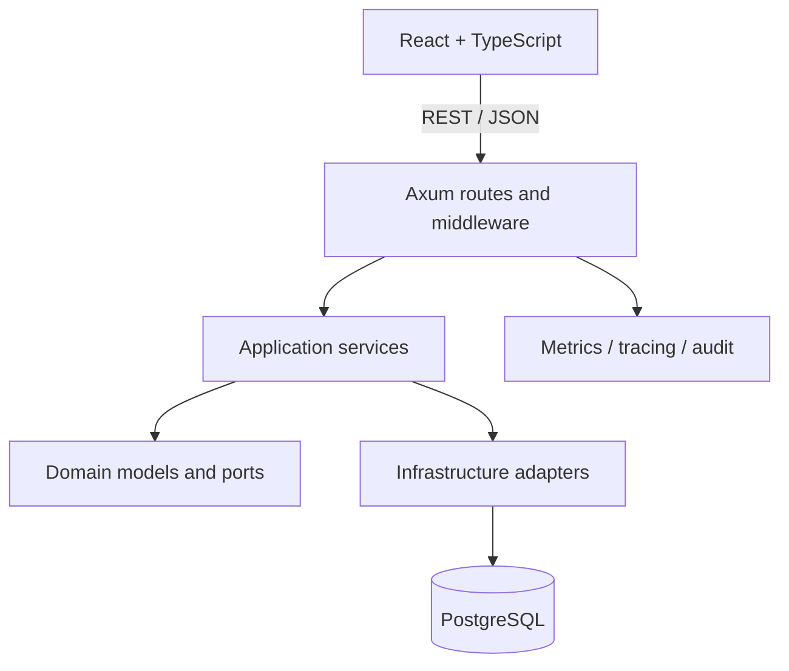

# HMS Elite — Engineering Case Study

## Problem

Hotel operations are stateful and cross-functional. Reception, housekeeping, administration and finance all act on the same stay, but they need different permissions and different views of that state.

The system therefore has to solve more than record storage. It must coordinate booking transitions, room state, charges and payments, tenant boundaries, operational handoffs and auditability without coupling every rule to HTTP handlers or frontend screens.

## Product scope

HMS Elite currently covers:

- rooms, availability and holds;
- guests and reservations;
- reception and stay lifecycle;
- housekeeping and maintenance states;
- extra charges, invoices, payments and cash closure;
- users, roles, capabilities and audit events;
- occupancy, revenue and operational reporting;
- hotel-scoped and network-level administration.

Verified product screens are committed under [`docs/screenshots`](screenshots/README.md).

## Architecture

The backend is a modular monolith with explicit domain, application and infrastructure boundaries.



### Domain

Business models, errors, policies and repository contracts live independently of Axum and SQLx.

### Application

Application services coordinate use cases such as reservations, reception transitions, billing, cash closure, housekeeping and user administration.

### Infrastructure

Adapters provide PostgreSQL persistence, HTTP handlers, authentication, authorization, telemetry and external-facing contracts.

## Key decisions

### 1. Modular monolith before microservices

The modules share operational transactions and evolve together. A single deployable backend keeps those transactions straightforward and limits deployment complexity. Service extraction is deferred until there is evidence that an independent scaling or ownership boundary is worth the coordination cost.

### 2. Booking lifecycle is not generic CRUD

A reservation can affect room state, billing state, audit history and housekeeping. Operational transitions therefore use explicit services and transactional repository paths rather than allowing arbitrary status mutation through a generic update endpoint.

This makes the important side effects visible and testable.

### 3. Tenant isolation is a backend and database concern

The UI does not define the security boundary. Hotel identity is propagated through authorization and repository calls, with tenant-scoped queries, composite constraints and targeted RLS policies providing additional enforcement.

RLS is intentionally not described as universal coverage: some tenant-scoped tables still rely on repository discipline and database constraints. The repository keeps that limitation explicit instead of presenting partial RLS as complete isolation.

### 4. Capabilities provide the authorization contract

Roles are assignment mechanisms; capabilities are the actual permissions. The backend enforces capabilities at route boundaries and the frontend uses the same contract for navigation and protected routes.

Automated checks detect drift between the canonical RBAC definition and its frontend/backend representations.

### 5. OpenAPI is a governed interface

The public API is versioned under `/api/v1`. The canonical OpenAPI document is checked against its documentation mirror and frontend expectations so contract changes are visible in CI rather than discovered at runtime.

### 6. Quality gates exercise workflows, not only units

Unit tests are useful for local rules, but the highest-risk defects in a PMS appear across boundaries: authentication, database state, booking transitions and responsive UI.

The CI pipeline therefore combines:

- Rust formatting, Clippy and unit tests;
- PostgreSQL / SQLx integration tests;
- authentication, authorization, CSRF and tenant regressions;
- frontend type checks and component tests;
- browser E2E for core journeys;
- mobile reception lifecycle runs;
- performance smoke checks;
- secret scanning and environment validation.

## Representative workflow

The reception lifecycle connects multiple modules:

```text
login
  ↓
reservation / walk-in
  ↓
guest + room assignment
  ↓
check-in
  ↓
charges + payments
  ↓
checkout
  ↓
room release
  ↓
housekeeping handoff
```

This journey is covered by browser-level tests and supporting backend integration tests so UI success is not treated as sufficient evidence by itself.

## Security approach

The repository includes:

- password hashing and token-based authentication;
- access and refresh-session handling;
- capability-based authorization;
- tenant-scoped data access;
- CSRF regression checks;
- CORS and security headers;
- general and authentication-specific rate limiting;
- request IDs and audit events;
- production-profile environment validation.

These are engineering controls, not a security certification. A real deployment still requires infrastructure hardening, secret management, privacy review, penetration testing and operational procedures appropriate to the organization using the system.

## Observability and operations

The local operational stack includes Prometheus, Grafana, Tempo and OpenTelemetry. The backend exposes health, readiness and metrics signals, while scripts support backup, restore, deployment rollback, environment validation and performance baselines.

This tooling exists to make runtime behavior inspectable; it is not a substitute for validating the product with real hotel operations.

## Trade-offs

### What the current approach buys

- transactional consistency across hotel workflows;
- clear internal boundaries without distributed-system overhead;
- explicit tenant and authorization contracts;
- reproducible local and CI environments;
- automated evidence across backend, frontend and browser journeys.

### What it costs

- more structure and CI maintenance than a small CRUD application requires;
- additional configuration for observability and security gates;
- broader test suites with longer execution time;
- risk of over-engineering if infrastructure work gets ahead of product validation.

The project deliberately keeps those costs visible. New infrastructure or architectural layers should be justified by an operational problem, not by novelty.

## Evidence

| Concern | Repository evidence |
|---|---|
| Domain/application separation | `backend/src/domain`, `backend/src/application` |
| Persistence and HTTP adapters | `backend/src/infrastructure` |
| API contract | `backend/openapi.yaml` |
| CI | `.github/workflows/full-stack-ci.yml` |
| Browser journeys | `frontend/e2e` |
| Product screens | `docs/screenshots` |
| Architecture decisions | `docs/adr` |
| Operations | `docs/ops`, `monitoring`, `scripts` |

## Current state and limitations

- The core reception lifecycle has automated and human acceptance evidence.
- Desktop product screenshots are committed and `v0.1.0` is tagged.
- Mobile reception work has been integrated after acceptance and canonical CI validation.
- No public hosted demo is linked yet.
- Production use requires environment-specific infrastructure, privacy, support and operational validation.
- Tenant protection is layered, but RLS coverage is not claimed for every tenant-scoped table.

The project remains a modular monolith because that is currently the simpler architecture for the product's transaction and deployment needs.
