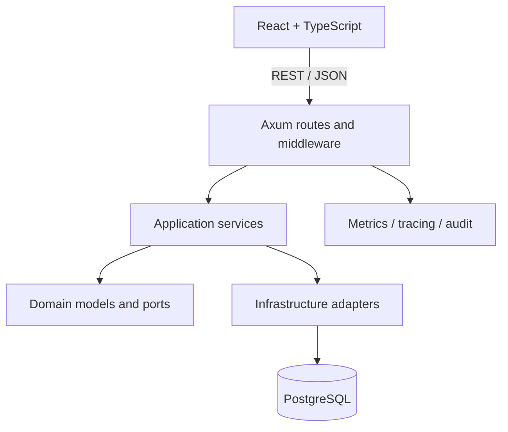

# HMS Elite — Engineering Case Study

## Problem

Hotel operations are stateful and cross-functional. Reception, housekeeping, administration and finance all act on the same stay, but they need different permissions and different views of that state.

HMS Elite therefore coordinates booking transitions, room state, charges and payments, tenant boundaries, operational handoffs and auditability instead of treating the domain as generic CRUD.

## Product scope

HMS Elite covers:

- rooms, availability and holds;
- guests and reservations;
- reception and stay lifecycle;
- housekeeping and maintenance states;
- extra charges, invoices, payments and cash closure;
- users, roles, capabilities and audit events;
- occupancy, revenue and operational reporting;
- hotel-scoped and network-level administration.

Verified product screens are committed under [`docs/screenshots`](screenshots/README.md).

## Architecture

The backend is a modular monolith with explicit domain, application and infrastructure boundaries.



### Domain

Business models, errors, policies and repository contracts live independently of Axum and SQLx.

### Application

Application services coordinate reservations, reception transitions, billing, cash closure, housekeeping and user administration.

### Infrastructure

Adapters provide PostgreSQL persistence, HTTP handlers, authentication, authorization, telemetry and external-facing contracts.

## Key engineering decisions

### Modular monolith before microservices

The modules share operational transactions and evolve together. A single deployable backend keeps those transactions straightforward and avoids distributed-system overhead without sacrificing internal boundaries.

### Lifecycle operations instead of generic CRUD

A reservation can affect room state, billing state, audit history and housekeeping. Check-in, checkout and related operations therefore use explicit services and transactional repository paths rather than arbitrary status mutation.

### Layered tenant isolation

Hotel identity is enforced below the UI boundary. Tenant-scoped access combines application tenant context, scoped repositories, relational constraints and PostgreSQL RLS policies on core tenant tables. Composite foreign keys protect cross-tenant relationships, while integration tests exercise tenant context and isolation behavior.

### Capability-based authorization

Roles assign sets of capabilities; capabilities are the permission contract. The backend enforces them at route boundaries and the frontend uses the same canon for protected navigation and actions. CI checks generated frontend/backend representations for drift.

### One canonical API contract

The public API is versioned under `/api/v1`. [`backend/openapi.yaml`](../backend/openapi.yaml) is the single canonical OpenAPI contract. CI checks route alignment, generated-client drift and contractual changelog updates.

### Workflow-level quality gates

The highest-risk PMS defects cross boundaries, so CI combines:

- Rust formatting, Clippy and unit tests;
- PostgreSQL / SQLx integration tests;
- authentication, authorization, CSRF and tenant regressions;
- frontend type checks and component tests;
- browser E2E for core journeys;
- mobile reception lifecycle checks;
- accessibility and performance smoke checks;
- secret scanning and environment validation.

## Representative workflow

```text
login
  ↓
reservation / walk-in
  ↓
guest + room assignment
  ↓
check-in
  ↓
charges + payments
  ↓
checkout
  ↓
room release
  ↓
housekeeping handoff
```

This journey is covered by browser-level tests and supporting backend integration tests so UI success is not treated as sufficient evidence by itself.

## Security approach

The repository includes password hashing, access/refresh-session handling, capability-based authorization, tenant-scoped data access, CSRF protection, explicit CORS and cookie controls, rate limiting, request IDs, audit events and production-profile environment validation.

These are engineering controls, not a certification. The repository threat model documents the implemented boundary and the operational runbooks describe the controls expected around a deployment.

## Observability and operations

The operational stack includes Prometheus, Grafana, Tempo and OpenTelemetry. The backend exposes health, readiness and metrics signals, while scripts support backup, restore, migration control, deployment rollback, environment validation and performance baselines.

Application rollback and database restore are intentionally separate operations: a failed application deployment can revert the application version, while destructive database restore requires explicit operator action.

## Trade-offs

The current approach provides transactional consistency across hotel workflows, clear internal boundaries, explicit tenant and authorization contracts, reproducible environments and automated evidence across backend, frontend and browser journeys.

The cost is a larger quality/operations surface than a simple CRUD application: more configuration, broader tests and more CI maintenance. The repository keeps that complexity tied to concrete operational and security concerns.

## Evidence map

| Concern | Repository evidence |
|---|---|
| Domain/application separation | `backend/src/domain`, `backend/src/application` |
| Persistence and HTTP adapters | `backend/src/infrastructure` |
| Database evolution | `backend/migrations` |
| API contract | `backend/openapi.yaml` |
| CI | `.github/workflows/full-stack-ci.yml` |
| Browser journeys | `frontend/e2e` |
| Product screens | `docs/screenshots` |
| Architecture decisions | `docs/adr` |
| Validation contracts | `docs/validation` |
| Operations | `docs/ops`, `monitoring`, `scripts` |
