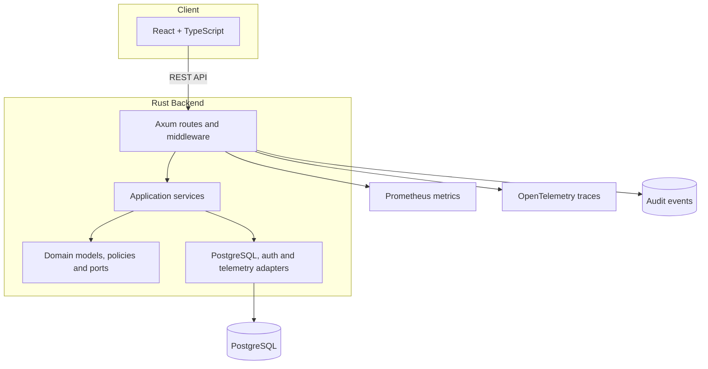

# HMS Elite — Portfolio Case Study

## Executive summary

HMS Elite is a full-stack hotel-management platform designed as a multi-tenant SaaS reference implementation. It combines a Rust backend, a React frontend, PostgreSQL persistence and an operational toolchain covering automated QA, security regression, observability and deployment readiness.

The project demonstrates how a complex operational domain can be converted into explicit business modules, authorization rules, API contracts and verifiable user journeys.

## The problem

Hotel operations are fragmented across reception, housekeeping, administration, finance and management. A useful management system must do more than store records: it must coordinate state transitions, protect tenant data, enforce role-specific permissions and preserve operational traceability.

The main engineering challenges addressed by HMS Elite are:

- Modelling hotel operations without coupling business rules to the web framework.
- Supporting multiple hotels while preventing cross-tenant data leakage.
- Representing different operational roles and capabilities.
- Coordinating bookings, room states, housekeeping and financial events.
- Providing actionable metrics without weakening security or maintainability.
- Building quality controls that verify complete journeys rather than isolated endpoints only.

## Product scope

### Operations

- Rooms and availability.
- Guests and bookings.
- Housekeeping queues and cleaning transitions.
- Hotel and network administration.

### Back office and security

- Authentication and session refresh.
- User administration.
- Roles and fine-grained capabilities.
- Audit events and UI telemetry.
- Tenant-scoped access controls.

### Finance and insights

- Extra charges.
- Invoices.
- Cash balance and closure.
- Occupancy and revenue reports.
- Hotel-level and network-level KPIs.

## Solution architecture

HMS Elite uses Clean/Hexagonal Architecture to keep business logic separate from HTTP, persistence and observability concerns.

### Domain layer

The domain defines business concepts and contracts independently from Axum and SQLx. This isolates the core model from transport and persistence decisions.

### Application layer

Application services orchestrate repositories, security contracts and domain operations. They provide explicit use-case boundaries for rooms, bookings, guests, users, housekeeping, billing, reporting and analytics.

### Infrastructure layer

Infrastructure adapters implement:

- PostgreSQL repositories with SQLx.
- Axum handlers and routing.
- JWT/session infrastructure.
- Password hashing.
- Request middleware.
- Metrics, tracing and audit integration.

## Key technical decisions

### 1. Modular monolith before microservices

A modular monolith reduces deployment and coordination overhead while preserving clear internal boundaries. It is appropriate for a product whose domain is still evolving and whose modules benefit from transactional consistency.

Potential future extraction points include analytics, billing integrations and network-level reporting, but only if operational evidence justifies the additional complexity.

### 2. Capability-based authorization

Roles are useful for assignment, but capabilities provide a more explicit authorization model. Route-level middleware enforces permissions such as room reading, booking writing, housekeeping operations and financial access.

The system uses deny-by-default principles and tests the authorization matrix with realistic role combinations.

### 3. Tenant isolation as a tested invariant

Multi-tenancy is not treated as a UI filter. Tenant identifiers are propagated through authorization and repository operations, and integration tests verify that data from another hotel is not returned.

### 4. OpenAPI as a governed contract

The API contract is versioned and checked against implementation and documentation. Automated alignment checks reduce drift between routes, schema documentation and frontend expectations.

### 5. QA as part of architecture

Quality is implemented as a set of automated gates rather than a final manual phase. The CI workflow covers:

- Formatting and linting.
- Unit and integration tests.
- Security regressions.
- Core business journeys.
- Frontend tests and builds.
- Browser E2E.
- Performance smoke checks.
- Secret scanning and CI stability.

## Security approach

The repository includes controls for:

- Authentication and refresh sessions.
- Password hashing.
- Capability-based RBAC.
- Tenant-scoped data access.
- CSRF/authentication regression checks.
- CORS restrictions.
- Security headers.
- Request-size limits.
- General and login-specific rate limiting.
- Audit events and request IDs.
- Production environment validation.

This is an engineering baseline, not a claim of formal security certification. A real production deployment would still require threat modelling, penetration testing, legal/privacy review and infrastructure-specific hardening.

## Observability and operations

The local operational stack includes Prometheus, Grafana, Tempo and OpenTelemetry. The backend exposes health, readiness and metrics signals, while scripts support performance baselines and production-readiness checks.

Operational tooling includes:

- Deploy with rollback.
- Backup and restore.
- Environment validation.
- Health and readiness checks.
- Performance and SLO evidence gates.
- Telemetry and audit persistence.

## Evidence in the repository

| Capability | Repository evidence |
|---|---|
| Full-stack implementation | `backend/` and `frontend/` |
| Multi-tenant authorization | RBAC middleware and tenant-scoped integration tests |
| API governance | `backend/openapi.yaml` and alignment scripts |
| Automated QA | `.github/workflows/full-stack-ci.yml` and `scripts/` |
| Observability | `monitoring/`, metrics middleware and telemetry modules |
| Deployment readiness | rollback, backup, restore and environment scripts |

## Trade-offs

### Benefits

- Strong domain separation.
- Explicit authorization and tenant boundaries.
- High automated-test coverage across layers.
- Reproducible local environment.
- Clear path from development to operational validation.

### Costs

- More structure than a small CRUD application requires.
- A broad CI pipeline increases execution time and maintenance.
- Observability and operational tooling add configuration surface.
- A portfolio project can become over-engineered if every production concern is implemented before validating users.

The current strategy keeps the system as a modular monolith and records remaining product evidence as explicit work rather than hiding it behind technical sophistication.

## Current limitations

- No public hosted demo is linked yet.
- Screenshots and a short product walkthrough are pending.
- The repository has not yet published a tagged stable portfolio release.
- Real hotel-user validation and organization-specific compliance work remain outside the current scope.

## Next milestones

1. Capture verified screenshots for the main role-based journeys.
2. Record a concise product walkthrough.
3. Publish a controlled read-only demonstration environment.
4. Tag a stable portfolio release.
5. Validate UX and workflows against realistic hotel scenarios.
6. Document measurable business outcomes from those scenarios.

## Professional relevance

HMS Elite is intended to demonstrate the ability to:

- Analyse a complex operational problem.
- Model business rules and access boundaries.
- Build a backend in Rust with a relational database.
- Integrate a typed frontend with a governed API.
- Treat QA, UX, security and observability as system concerns.
- Make architectural trade-offs visible and reviewable.